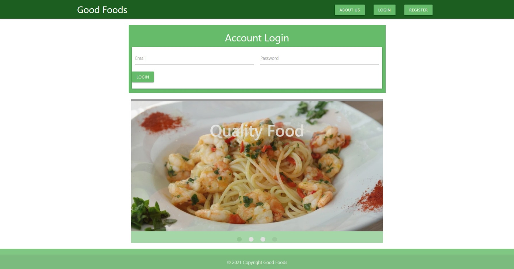
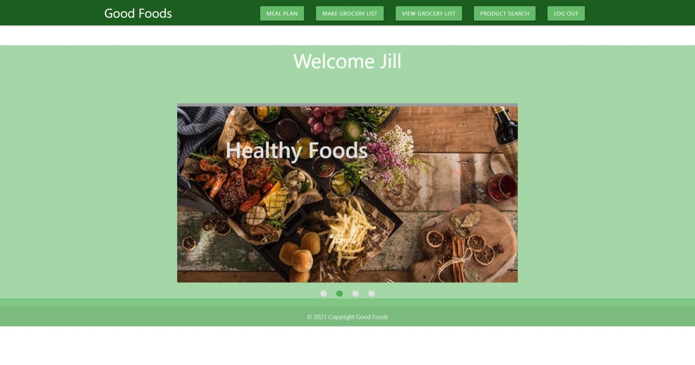
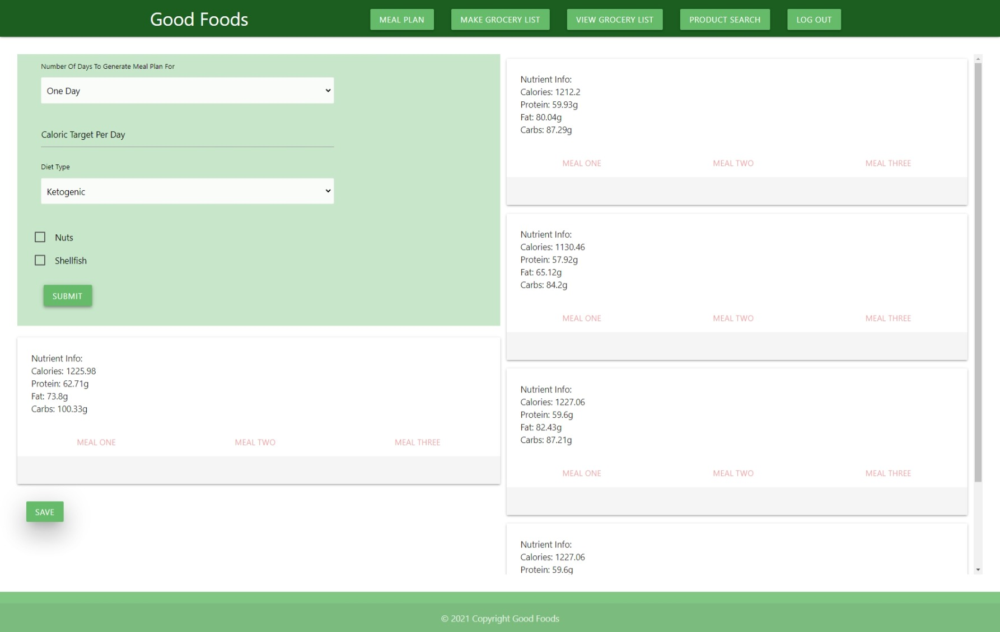
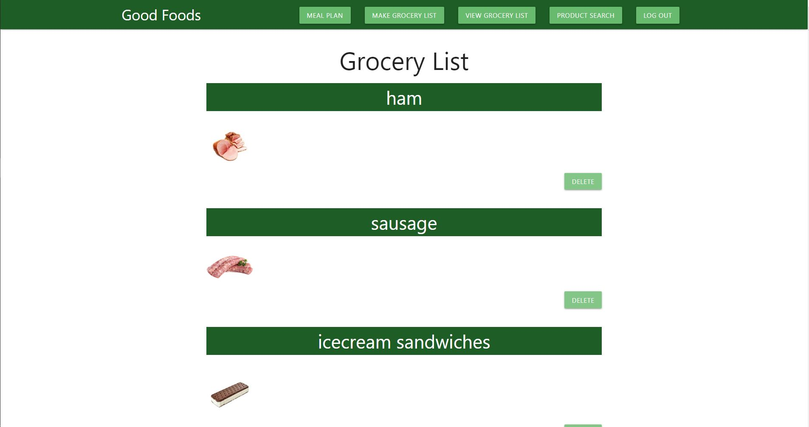
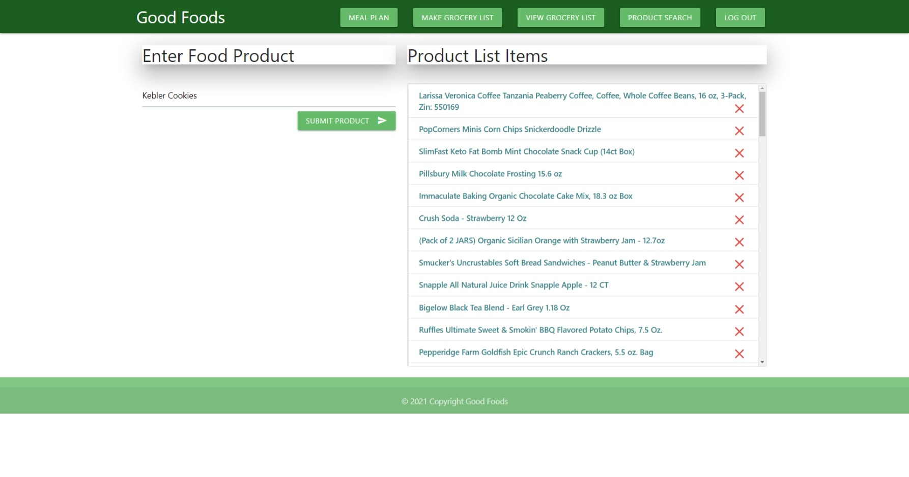
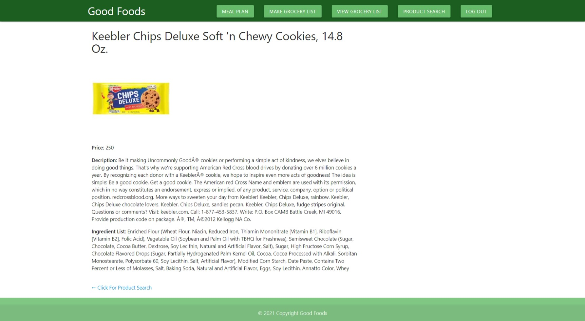

# Good Foods: Meal Planning and Nutritional Application

  

***

  ## Description:
  An application for tracking, storing, and retrieving meal planning information, grocery lists, and nutritional health values of food/meals. Spoonacular API will be incorporated into the application. The application will have user authentication which will be saved in a database. In addition, the user will have the ability to save information into the database.  
  
***
  ## Table of Contents:
  1.  [Description](#description)
  2.  [Demonstration](#demonstration)
  3.  [Installation](#installation)
  4.  [Screenshots](#screenshots)
  5.  [Technologies](#technologies)
  6.  [Usage](#usage)
  7.  [License](#license)
  8.  [Contributing](#contributing)
  9.  [Tests](#tests)
  10.  [Questions](#questions)

***
  ## Demonstration:
  [Deployed website link](https://thawing-ravine-25396.herokuapp.com/login)

***
  ## Installation:
  To use this application, the user can fork or clone it from Github, or use it from the above website link..  If cloning or forking, follow these additional instructions.  Run `npm install`. See the technologies section for the application dependencies.  In addition, the user will need to connect to an active database server for full functionality.  However, any users may freely use this deployed application at the above deploy application website.

***
  ## Screenshots:
  ### (Deployed Application)
  

  ### (User Login)
  

  ### (Meal Plan Search/View)
  

  ### (Grocery List)
  

  ### (Product Search)
  

  ### (Product Search Results)
  

***
  ## Technologies
  - Node.js
  - Express.js
  - MongoDB
  - Mongoose
  - React
  - Dotenv
  - Cors
  - Bcryptjs
  - Materialize
  - jsonWebToken

  ## Usage:
  This application utilizes several web and database technologies to allow a user to create and track meal plans, search food products, and make a grocery list.
   
***
  ## License:
  This project falls under the MIT License.  The full documentation for this license can be found at [MIT Full Documentation](https://choosealicense.com/licenses/mit).

  Below is an excerpt of the MIT License.
   
  Copyright <YEAR> <COPYRIGHT HOLDER>
    
    Permission is hereby granted, free of charge, to any person obtaining a copy of this software and associated documentation files (the "Software"), to deal in the Software without restriction, including without limitation the rights to use, copy, modify, merge, publish, distribute, sublicense, and/or sell copies of the Software, and to permit persons to whom the Software is furnished to do so, subject to the following conditions:
    The above copyright notice and this permission notice shall be included in all copies or substantial portions of the Software.
    THE SOFTWARE IS PROVIDED "AS IS", WITHOUT WARRANTY OF ANY KIND, EXPRESS OR IMPLIED, INCLUDING BUT NOT LIMITED TO THE WARRANTIES OF MERCHANTABILITY, FITNESS FOR A PARTICULAR PURPOSE AND NONINFRINGEMENT. IN NO EVENT SHALL THE AUTHORS OR COPYRIGHT HOLDERS BE LIABLE FOR ANY CLAIM, DAMAGES OR OTHER LIABILITY, WHETHER IN AN ACTION OF CONTRACT, TORT OR OTHERWISE, ARISING FROM, OUT OF OR IN CONNECTION WITH THE SOFTWARE OR THE USE OR OTHER DEALINGS IN THE SOFTWARE.

  ## Contributing:
  To contribute to this project, please send an email.  
   
  The contributors for this project are:
  - Norman Cerros
  - D. Javan Worthy
  - Bruce Mowrey
  - Leighton Jenkins
 

***
  ## Tests:
  There was entensive testing of routes with Insomnia.  The data/communication routes must be verified before this application can be properly deployed.  In addition, there must be an operational database  and it must be connected to the application to receive the full functionality.  

***
  ## Questions:
  - The GitHub profiles for this project are:
    - https://github.com/bmowrey729
    - https://github.com/ncerros
    - https://github.com/LD-Jenkins
    - https://github.com/djavanw
 
  - If there are any questions, please contact Leighton at leightonjenkins84@gmail.com.
